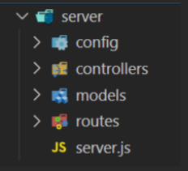

- [ ] create [server](./server/server.js) directory
- [ ] init node project:

```bash
npm init -y
```

- this will use the previously created [server.js](./server/server.js)

- [ ] install express:

```
npm i express
```


