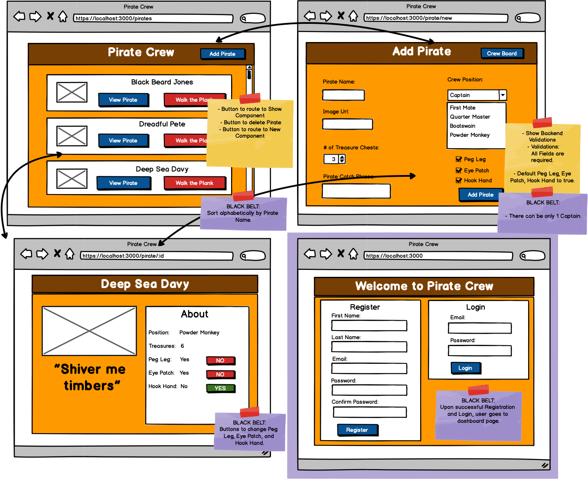

# For a red belt:
Dashboard: Display all pirates
Users can create new pirates
Users can remove pirates
Validations
All fields are required
Display back end errors

# For a black belt:
Deployed on Amazon EC2
## And 2 of the following:

- Login and Registration - the user must login or register to use the rest of the app
- Only one pirate is permitted to be captain (at a time)
- Buttons that allow for editing: eye-patch, peg-leg, and hook-hand
- Use front-end validations in addition to the back-end validations
- Pirates on the dashboard should be sorted by name alphabetically

# General Guidelines
Do everything the prompts ask for. Ask your instructor if you are not sure.
Download the wireframe [here](https://assets.codingdojo.com/boomyeah2015/codingdojo/curriculum/content/chapter/PirateCrew.png): PirateCrew

**All files must be submitted in order to receive a grade. This includes all files required for the project to run as intended and any extra files the course may require. Failure to include all files will result in the exam not being graded, which may result in an automatic fail for the exam attempt.**